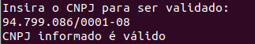
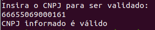
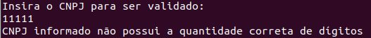
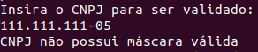
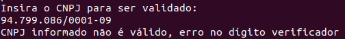
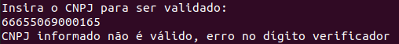

# CNPJ Validator

## About the Problem

Given a string, check if it looks like a CNPJ, considering two formats: Formatted and Number Only.
Also, validate if it's a well-formed CNPJ, considering the "check digits", as defined by Receita Federal in [here](https://pt.wikipedia.org/wiki/Cadastro_Nacional_da_Pessoa_Jur%C3%ADdica).

## How to run this Code

> **Note:** All commands are considering this folder as a reference

> **Dependencies:** To run this code you will need a JDK or a JRE installed.

The binaries files are already compiled for you. So you just need to run the following command on your terminal:

```bash
    cd bin/ && java App
```

This will open the binaries folder and execute the app.

As an extra you can run the tests in this project by running the following command:

```bash
    cd bin/ && java -jar ../lib/junit-platform-console-standalone-1.7.0-all.jar -cp "." --select-class TestCNPJValidator
```

## About my solution

This seems like a validation kind of problem. In these scenarios I like to use the Test Driven Design approach. For the following reasons:

- When working with validation problems TDD helps you understand which cases your code already cover by looking at the test you have
- Adding new case of validation is pretty straight forward since you only need to add another test case
- If you have a lot of validations to make your code tend to become messy. With the test suit you build you feel more comfortable to do the necessary refactors.

### Expected Input

For starter, I will consider the app running in a Command Line Interface. This will be a simpler implementation which will allow me to focus on the core problem. Maybe later I can implement a GUI using some lib if time permits.

> **Therefore, the expected input is a CNPJ typed in the command line interface**

### Expected Output

> **I expect the program to be able to tell the user if the CNPJ is valid or not. By returning a user-friendly Message that will warn him of possible mistakes.**

## About the Stack Used

This is the kind of problem that probably could be easier solved with Python. However, since Java is part of the provided stack it seemed like a nice idea to do this implementation on it.

I also don't have many opportunities to code in Java, which is a language I kind of fancy, so blame me to be happy ;).

I'm also using JUnit in this implementation to provide me the necessary functions for the Tests.

## The To-do List

When working, especially with TDD, I like to set some milestones and follow them during development. This helps me keep organized and set a "Done" definition to the project as well as keep my progress in a visual way which kind of motivates me through the end.

So there will be an extra todo.md file in the project where you can find my milestones and thoughts during the project

## Images and Videos

Here are some prints of the working software:












