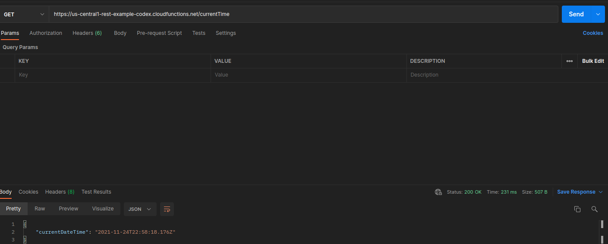

# Rest Server - Work Clock

## How to run this code

You can compile and run this code by using Node (npm) and firebase CLI. However, this is a Web aplication, so in order for you not to install anything, I've deployed the app in the following URL:

> https://us-central1-rest-example-codex.cloudfunctions.net/currentTime

If you still wanna run it, istall Node, npm, fibase CLI and run the following inside the functions folder:

> npm run build
> && firebase emulators:start

Now go to the following URL:

> http://localhost:5001/rest-example-codex/us-central1/currentTime

## About the Problem

Rest server returning a JSON like, with the current date / time:

Example of return:

```json
{
  "currentDateTime": "2021-08-12T14:40Z"
}
```

## About the Solution

This is for sure the easier problem to solve. Since it's such a simple problem, I'm not gone complicate in. In fact I decided to make it as fast as possible, to prove that sometimes fast is better, especially when you are trying new products or ideas.

So there is nothing very fancy here, just a route with the logic inside. Plain, simple, and the best part it works as asked.

## About the stack I used

Once again I'm using Firebase. This is such a complete service, this time I'm using it because it's really simple to make a simple backend using Firebase Functions. With some simple commands you can bootstrap the project and with some other commands it will be deployed to production using Firebase Hosting. When using Firebase cloud functions, you will need to update you plan from free to "pay as you go", however you will still have 2 million free requests, I don't think we are gone pass that limit in this app rsrs.

I'm using JS framework Express for the routing system. Express it's also pretty straight forward and it communicates really well with Firebase functions. So we have a really powerful pair here.

## Images and videos of application

Here there is a print of a request to the app made via PostMan:

